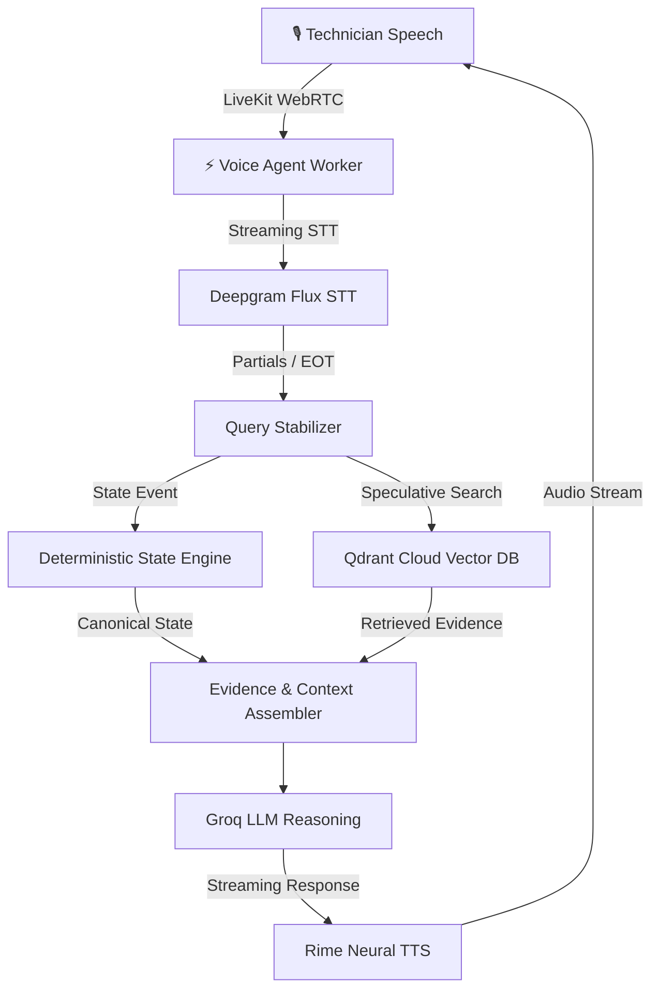

# 🛠️ FieldMate — Real-time Voice Diagnostic Partner

FieldMate is an ultra-low-latency, voice-first field diagnostic assistant engineered for hardware, software, and network troubleshooting on Windows PCs and laptops (Lenovo, Dell, HP, ASUS).

Unlike generic conversational RAG chatbots, FieldMate **owns canonical diagnostic state** and uses a deterministic state engine, evolving vector memory with Qdrant, speculative prefetching, and high-performance streaming voice tools to act as an active diagnostic partner for field technicians.

---

## 🌟 Key Differentiators

* **Canonical Diagnostic State Engine**: The application owns and validates state transitions deterministically with immutable event logs and rollbacks. The LLM reasons *over* state and evidence rather than hallucinating state.
* **State-Aware Qdrant Retrieval**: Uses hybrid dense (`all-MiniLM-L6-v2`) and sparse (`BM25`) search over Qdrant Cloud to retrieve structured technical manuals, prior cases, and fault correlations.
* **Speculative Voice Prefetching**: Integrates query stabilization on streaming STT partials to launch speculative vector searches *before* the technician finishes speaking, delivering response latencies under ~0.2ms for pre-fetched context.
* **Evolving Memory Lifecycle**: Tracks evidence provenance, resolution confidence, and domain contradictions across cases without premature generalization.
* **Ultra-Low Latency Voice Pipeline**: Powered by LiveKit WebRTC transport, Deepgram streaming STT, Groq LLM inference, and Rime Neural TTS.

---

## 🏗️ System Architecture



---

## 💻 Domain Scope

FieldMate is deeply optimized for **Windows PCs & Laptops** across four primary OEMs:
- **Lenovo** | **Dell** | **HP** | **ASUS**

### Troubleshooting Subsystems:
* **Hardware**: RAM, SSD/HDD, thermals & cooling fans, battery/charging, display, keyboard, touchpad, USB, motherboard diagnostics.
* **Software**: Windows boot loops, driver conflicts, Windows services, update failures, BSODs, system corruptions, permissions.
* **Networking**: Wi-Fi, Ethernet, DNS, DHCP, network adapters, Windows network configurations, router/client interaction.

---

## 🛠️ Tech Stack

| Layer | Technology |
| :--- | :--- |
| **Realtime Transport** | [LiveKit Agent SDK](https://livekit.io) |
| **Speech-to-Text (STT)** | [Deepgram Flux Streaming](https://deepgram.com) |
| **Text-to-Speech (TTS)** | [Rime AI](https://rime.ai) |
| **LLM Reasoning** | [Groq](https://groq.com) |
| **Vector DB / Memory** | [Qdrant Cloud](https://qdrant.tech) (Dense + BM25 Hybrid Search) |
| **Backend Orchestration** | FastAPI, Python 3.12, `uv` |
| **Frontend HUD** | React, Vite, LiveKit Web Components, Lucide Icons |

---

## 🚀 Quickstart Guide

### 1. Prerequisites
- **Python 3.12+** & [`uv`](https://github.com/astral-sh/uv) package manager installed
- **Node.js 18+** & `npm` installed
- Accounts & API keys for LiveKit Cloud, Deepgram, Groq, Rime, and Qdrant Cloud.

### 2. Installation & Configuration

Clone the repository:
```bash
git clone https://github.com/esotericdunce/fieldmate.git
cd fieldmate
```

Create your environment configuration:
```bash
cp .env.example .env
```

Edit `.env` and fill in your API credentials:
```env
LIVEKIT_URL=wss://your-livekit-project.livekit.cloud
LIVEKIT_API_KEY=your_livekit_api_key
LIVEKIT_API_SECRET=your_livekit_api_secret

DEEPGRAM_API_KEY=your_deepgram_api_key
GROQ_API_KEY=your_groq_api_key
RIME_API_KEY=your_rime_api_key

QDRANT_URL=https://your-qdrant-cluster.cloud.qdrant.io
QDRANT_API_KEY=your_qdrant_api_key
```

### 3. Install Dependencies & Build Frontend

Install Python dependencies:
```bash
uv sync
```

Install Node dependencies and build the static frontend:
```bash
cd frontend
npm install
npm run build
cd ..
```

### 4. (Optional) Ingest Technical Knowledge Base

If setting up a fresh Qdrant collection, ingest technical documents:
```bash
uv run python -m fieldmate.ingest --dir /path/to/troubleshooting/docs/
```

### 5. Launch FieldMate

Start the unified server (spawns FastAPI web server + LiveKit voice worker):
```bash
uv run python main.py
```

Open your browser and navigate to:
```
http://localhost:8000
```
Click **Start Session** and begin speaking to your diagnostic partner!

---

## 🧪 Testing & Verification

Run the full test suite (including deterministic state engine, atomicity, idempotency, and retrieval tests):
```bash
uv run pytest
```

---

## 📜 License

MIT License — feel free to use and adapt FieldMate for your own diagnostic and realtime AI applications!
