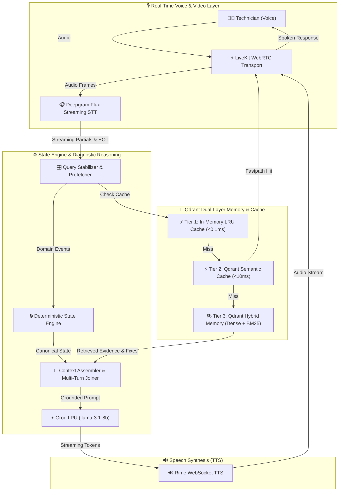

<div align="center">

# 🛠️ FieldMate

**The ultra-low-latency, real-time voice diagnostic partner for field technicians.**

[](https://opensource.org/licenses/MIT)
[](https://www.python.org/downloads/)
[](https://fastapi.tiangolo.com)
[](https://livekit.io)
[](https://qdrant.tech)
[](https://github.com/psf/black)

FieldMate is an open-source, hands-free diagnostic assistant engineered for hardware, software, and network troubleshooting. It acts as an active partner for field technicians, drastically lowering cognitive load and speeding up repair times through seamless real-time voice interaction.

[Report Bug](https://github.com/esotericdunce/fieldmate/issues) · [Request Feature](https://github.com/esotericdunce/fieldmate/issues) · [Explore Documentation](#-system-architecture)

</div>

---

## 📖 Project Description

> [!NOTE]
> **The Problem:** Field technicians troubleshooting complex hardware, software, and networking issues face a massive cognitive load. They must operate testing equipment, manipulate devices physically, navigate manuals, and log findings—all simultaneously. Standard visual or text-based interfaces are a severe bottleneck when hands and eyes are occupied. This inefficiency leads to extended downtime, costly repeated visits, and the permanent loss of domain knowledge when senior technicians retire.

**Our Solution:**  
We built FieldMate to solve this bottleneck. It is a low-latency, voice-first diagnostic partner that actively reasons alongside the technician in real-time. 

**Scientific & Development Contribution:**  
Unlike generic conversational RAG (Retrieval-Augmented Generation) chatbots, FieldMate **owns canonical diagnostic state**. We contribute a novel **deterministic state engine** paired with a continuous multi-tier semantic caching system and long-term episodic vector memory. This architecture ensures the LLM reasons over verified, structured diagnostic state rather than unstructured text dumps—drastically reducing hallucinations and latency while providing verifiable provenance.

---

## ✨ Key Features

- ⚡ **Multi-Tier Semantic Caching:** Sub-millisecond (`<0.1ms`) LRU cache and sub-`15ms` Qdrant vector semantic caching to eliminate redundant LLM generation.
- 🧠 **Canonical State Engine:** Deterministic rule-based engine that ensures invalid LLM hallucinations never corrupt the working diagnostic state.
- 🎙️ **Streaming Voice Pipeline:** WebRTC powered by LiveKit with Deepgram Flux STT and Rime WebSocket TTS for an instant, human-like conversational flow.
- 🧩 **Multi-Turn Assembly:** Automatically reconstructs fragmented technician utterances to fetch the right manual or prior case study from vector memory.

---

## 🏗️ System Architecture

<details>
<summary><b>Click to view the System Architecture Diagram</b></summary>



</details>

---

## 🚀 Reproducibility & Setup

> [!IMPORTANT]
> Ensure you have **Python 3.12+**, **Node.js 18+**, and valid API keys for LiveKit, Deepgram, Groq, Rime, and Qdrant before starting.

### 1. Installation

```bash
# Clone the repository
git clone https://github.com/esotericdunce/fieldmate.git
cd fieldmate

# Install backend dependencies using uv
uv sync

# Build Frontend HUD
cd frontend
npm install && npm run build
cd ..
```

### 2. Configuration

Copy the example `.env` file and populate it with your credentials:
```bash
cp .env.example .env
```
*(Required keys: `LIVEKIT_URL`, `LIVEKIT_API_KEY`, `LIVEKIT_API_SECRET`, `DEEPGRAM_API_KEY`, `GROQ_API_KEY`, `RIME_API_KEY`, `QDRANT_URL`, `QDRANT_API_KEY`)*

### 3. Run FieldMate

Launch the unified server (spawns both the FastAPI backend and the LiveKit worker):
```bash
uv run python main.py
```
🌐 Open `http://localhost:8000` in your browser and click **Start Session**.

### 4. Running the Tests
To verify the deterministic state engine and semantic cache benchmarks, execute our automated test suite:
```bash
PYTHONPATH=src uv run pytest
```

---

## 📊 Performance Metrics

FieldMate is engineered for ultra-low-latency real-time voice interaction. We actively monitor and optimize the following critical metrics:

| Metric | Target | Why it was chosen |
| :--- | :--- | :--- |
| **End-to-End Voice Latency** | `< 800ms` | Latency over 1s breaks conversational flow. Sub-800ms ensures the technician feels they are speaking with a responsive, human-like partner. |
| **Tier 1 LRU Cache Hit** | `< 0.1ms` | Captures exact-match repeat queries instantly without network overhead, entirely bypassing LLM and vector DB round-trips. |
| **Tier 2 Semantic Cache (Qdrant)** | `< 15ms` | Validates that paraphrased identical intents are caught before invoking the LLM, reducing generation time by up to 90% for common diagnostic loops. |
| **State Atomicity Rollbacks** | `100% Success` | Validated via our adversarial suite, proving that invalid LLM transitions are safely discarded without corrupting the canonical state. |

---

## 🗺️ Roadmap

- [x] Integrate LiveKit WebRTC Transport
- [x] Build multi-tier semantic cache (LRU + Qdrant)
- [x] Design canonical diagnostic state engine
- [x] Stream Deepgram Flux STT & Rime TTS
- [ ] Add multimodal Vision Inspection (WebRTC Data Channel OCR)
- [ ] Implement adaptive voice interruption tuning
- [ ] Open-source the hardware diagnostic procedural datasets
- [ ] Build standalone desktop electron wrapper for native hardware telemetry

---

## 🤝 Credits & Partners

A massive thank you to our incredible partners whose cutting-edge technology made FieldMate possible. We are proud to build on top of their robust platforms:

- 🌟 **Pathway**: For pioneering data processing and real-time streams.
- 🌟 **Rime**: For the ultra-fast, expressive, and human-like neural TTS WebSocket streaming.
- 🌟 **Weya**: For seamless platform support and robust infrastructure.
- 🌟 **Qdrant**: For powering both our sub-15ms semantic caching and our long-term hybrid dense/sparse diagnostic memory layer.

---

## 🛡️ License & Contributing

Distributed under the MIT License. See `LICENSE` for more information.

Contributions are what make the open source community such an amazing place to learn, inspire, and create. Any contributions you make are **greatly appreciated**.

1. Fork the Project
2. Create your Feature Branch (`git checkout -b feature/AmazingFeature`)
3. Commit your Changes (`git commit -m 'Add some AmazingFeature'`)
4. Push to the Branch (`git push origin feature/AmazingFeature`)
5. Open a Pull Request

<div align="center">
  <sub>Built with ❤️ for field technicians everywhere.</sub>
</div>
