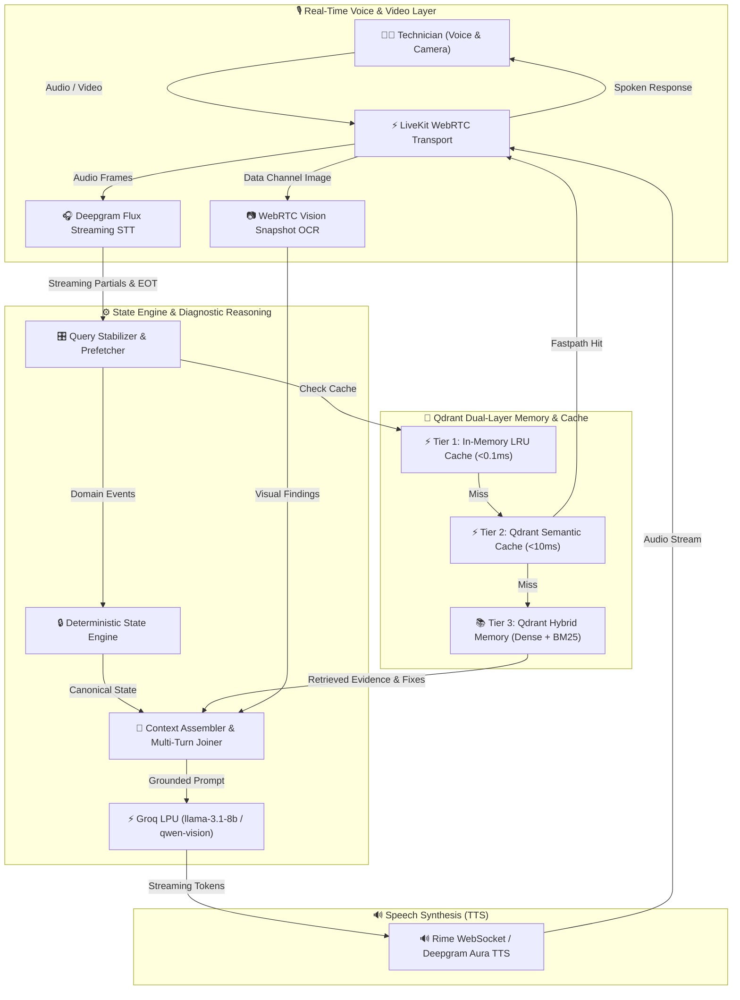

# 🛠️ FieldMate — Real-Time Voice Diagnostic Partner

FieldMate is an ultra-low-latency, voice-first field diagnostic assistant engineered for hardware, software, and network troubleshooting on Windows PCs and laptops (Lenovo, Dell, HP, ASUS).

Unlike generic conversational RAG chatbots, FieldMate **owns canonical diagnostic state** and pairs a deterministic state engine with **multi-tier semantic caching**, **long-term episodic vector memory with Qdrant**, **multimodal vision inspection**, and **real-time streaming voice tools** to act as an active diagnostic partner for field technicians.

---

## 🌟 Key Capabilities & Differentiators

* ⚡ **3-Tier Smart Semantic Cache**:
  - **Tier 1 (In-Memory LRU)**: Sub-millisecond (`<0.1ms`) memory cache for repeated queries.
  - **Tier 2 (Qdrant Semantic Cache)**: Real-time vector cosine similarity (`<10ms`) across paraphrases with strict user isolation (`owner_id`), hardware context tagging, and cross-restart persistence.
  - **Tier 3 (Groq LPU Generation)**: Ultra-fast LLM inference using Groq `llama-3.1-8b-instant`.
* 🧠 **Long-Term Domain & Resolution Memory (`fieldmate_memory`)**:
  - Hybrid Dense (`all-MiniLM-L6-v2`) + Sparse (`BM25`) search over Qdrant Cloud.
  - Stores verified engineering procedures, past confirmed case resolutions, and evidence provenance.
* 🔄 **Multi-Turn Elliptical Context Assembly**:
  - Automatically reconstructs short or staggered technician utterances (e.g., Turn 1: *"my laptop keyboard light won't turn on"* ➔ Turn 2: *"its dell, how to fix it"*) to retrieve and cite past verified fixes.
* 👁️ **Multimodal Visual Inspection**:
  - Real-time video snapshot capture over LiveKit WebRTC data channel.
  - Groq Vision inference (`qwen/qwen3.6-27b`) for motherboard capacitor inspection, physical port damage, and BIOS/BSOD error code OCR.
* 🎙️ **Real-Time Voice Pipeline & Dual TTS Engine**:
  - LiveKit WebRTC transport + Deepgram Flux streaming STT.
  - Dual TTS support: **Rime Neural TTS** (WebSocket streaming) and **Deepgram Aura TTS** (`aura-asteria-en`).
  - Acoustic-guarded barge-in interruption.

---

## 🏗️ System Architecture



---

## 💻 Domain Scope

FieldMate is deeply optimized for **Windows PCs & Laptops** across four primary OEMs:
- **Lenovo** | **Dell** | **HP** | **ASUS**

### Troubleshooting Subsystems:
* **Hardware**: RAM, SSD/HDD, thermals & cooling fans, battery/charging, display, keyboard, touchpad, USB, motherboard diagnostics.
* **Software**: Windows boot loops, driver conflicts, Windows services, update failures, BSODs, system corruptions, permissions.
* **Networking**: Wi-Fi, Ethernet, DNS, DHCP, network adapters, Windows network configurations, router/client interaction.

---

## 🛠️ Tech Stack

| Layer | Technology | Purpose |
| :--- | :--- | :--- |
| **Realtime Transport** | [LiveKit Agent SDK](https://livekit.io) | Sub-100ms WebRTC voice & video transport |
| **Speech-to-Text (STT)** | [Deepgram Flux Streaming](https://deepgram.com) | Real-time endpointing and speech-to-text |
| **Text-to-Speech (TTS)** | [Rime AI](https://rime.ai) & [Deepgram Aura](https://deepgram.com) | Ultra-smooth neural voice synthesis |
| **LLM & Vision Inference** | [Groq](https://groq.com) | Llama 3.1 8B Instant & Qwen 3.6 27B Vision |
| **Semantic Cache** | [Qdrant Cloud](https://qdrant.tech) (`fieldmate_semantic_cache`) | Sub-10ms query/response caching |
| **Domain Vector Memory** | [Qdrant Cloud](https://qdrant.tech) (`fieldmate_memory`) | Dense + BM25 Hybrid Case & Procedure Retrieval |
| **Backend Framework** | FastAPI, Python 3.12, `uv` | High-concurrency async orchestration |
| **Frontend HUD** | React, Vite, LiveKit Web Components, Lucide | Real-time audio waveform, logs, and state HUD |

---

## 🚀 Quickstart Guide

### 1. Prerequisites
- **Python 3.12+** & [`uv`](https://github.com/astral-sh/uv) package manager
- **Node.js 18+** & `npm`
- API credentials for LiveKit Cloud, Deepgram, Groq, Rime, and Qdrant Cloud.

### 2. Installation & Configuration

Clone the repository:
```bash
git clone https://github.com/esotericdunce/fieldmate.git
cd fieldmate
```

Create your environment configuration:
```bash
cp .env.example .env
```

Edit `.env` and fill in your credentials:
```env
LIVEKIT_URL=wss://your-livekit-project.livekit.cloud
LIVEKIT_API_KEY=your_livekit_api_key
LIVEKIT_API_SECRET=your_livekit_api_secret

DEEPGRAM_API_KEY=your_deepgram_api_key
GROQ_API_KEY=your_groq_api_key
RIME_API_KEY=your_rime_api_key

QDRANT_URL=https://your-qdrant-cluster.cloud.qdrant.io
QDRANT_API_KEY=your_qdrant_api_key

# Optional Customizations:
FIELDMATE_USER_ID=tech_john_doe
FIELDMATE_SEMANTIC_CACHE_THRESHOLD=0.75
FIELDMATE_TTS_PROVIDER=rime  # or 'deepgram'
```

### 3. Install Dependencies & Build Frontend

```bash
# Install Python dependencies
uv sync

# Build Frontend HUD
cd frontend
npm install
npm run build
cd ..
```

### 4. Launch FieldMate

Start the unified server (spawns FastAPI web server on `:8000` + LiveKit voice worker):
```bash
uv run python main.py
```

Open your browser and navigate to:
```
http://localhost:8000
```
Click **Start Session** to start diagnosing!

---

## 🧪 Testing & Verification

Run the full automated test suite (including deterministic state engine, semantic cache multi-process persistence, atomicity, idempotency, and vision tests):
```bash
PYTHONPATH=src uv run pytest
```

---

## 📜 License

MIT License — feel free to use and adapt FieldMate for your own diagnostic and real-time AI applications!
