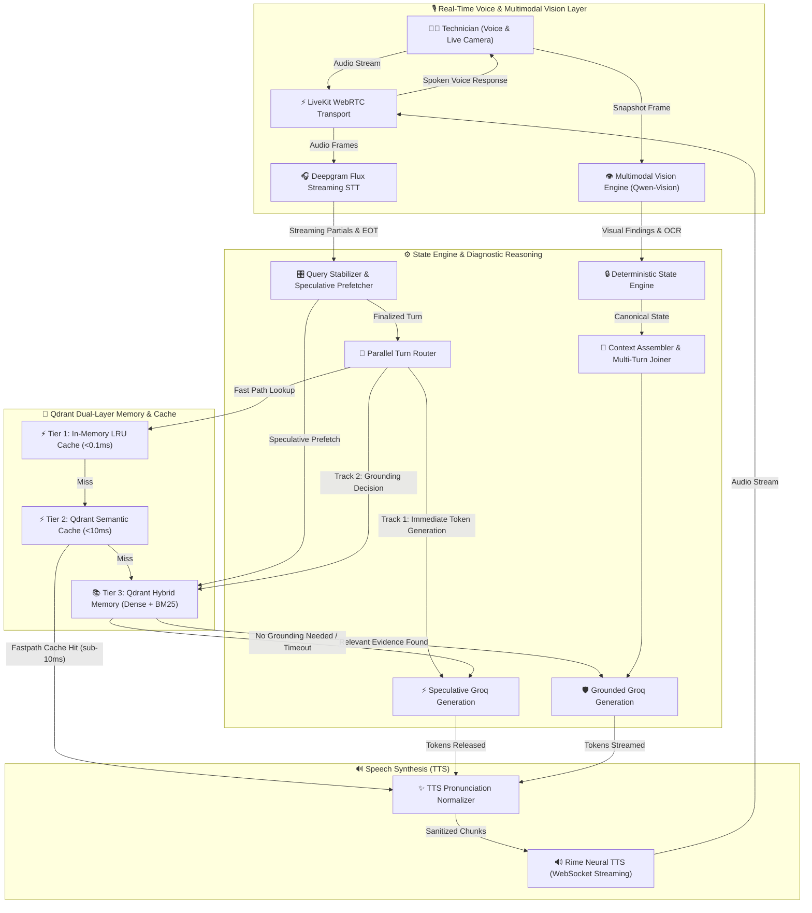

<div align="center">

# 🛠️ FieldMate

**The ultra-low-latency, real-time voice & multimodal diagnostic partner for field technicians.**

[](https://opensource.org/licenses/MIT)
[](https://www.python.org/downloads/)
[](https://fastapi.tiangolo.com)
[](https://livekit.io)
[](https://qdrant.tech)
[](https://github.com/psf/black)

FieldMate is an open-source, hands-free diagnostic assistant engineered for complex hardware, software, and networking troubleshooting. It acts as an active partner for field technicians, drastically lowering cognitive load and speeding up repair times through seamless real-time voice and live camera vision inspection.

[Report Bug](https://github.com/esotericdunce/fieldmate/issues) · [Request Feature](https://github.com/esotericdunce/fieldmate/issues) · [Explore Architecture](#️-system-architecture)

</div>

---

## 📖 Project Description

> [!NOTE]
> **The Problem:** Field technicians troubleshooting complex hardware, software, and networking issues face a massive cognitive load. They must operate testing equipment, manipulate devices physically, navigate manuals, and log findings—all simultaneously. Standard visual or text-based interfaces are a severe bottleneck when hands and eyes are occupied. This inefficiency leads to extended downtime, costly repeated visits, and the permanent loss of domain knowledge when senior technicians retire.

**Our Solution:**  
We built FieldMate to solve this bottleneck. It is a low-latency, voice-first, multimodal diagnostic partner that actively reasons alongside the technician in real-time. 

**Scientific & Development Contribution:**  
Unlike generic conversational RAG (Retrieval-Augmented Generation) chatbots, FieldMate **owns canonical diagnostic state**. We contribute a novel **deterministic state engine** paired with a continuous multi-tier semantic caching system, multimodal vision OCR, and long-term episodic vector memory. This architecture ensures the LLM reasons over verified, structured diagnostic state rather than unstructured text dumps—drastically reducing hallucinations and latency while providing verifiable provenance.

---

## ✨ Key Features

- ⚡ **Multi-Tier Semantic Caching:** Sub-millisecond (`<0.1ms`) LRU cache and sub-`15ms` Qdrant vector semantic caching with per-user isolation and context guards to eliminate redundant LLM generation.
- 👁️ **Multimodal Vision Inspection:** Real-time visual analysis powered by `Qwen 3.6-27B Vision` to inspect motherboard schematics, error codes, port damage, and hardware serial barcodes directly over WebRTC.
- 🧠 **Canonical State Engine:** Deterministic rule-based engine enforcing immutable event logs, turn fencing, and atomic rollbacks so LLM hallucinations never corrupt diagnostic state.
- 🎙️ **Streaming Voice Pipeline:** WebRTC powered by LiveKit with Deepgram Flux STT and Rime WebSocket TTS for an instant, human-like conversational flow.
- 🎛️ **Query Stabilizer & Speculative Prefetching:** Stabilizes streaming transcript deltas and prefetches relevant technical evidence into memory before the technician finishes speaking.
- 🧩 **Multi-Turn Context Assembly:** Automatically reconstructs elliptical technician utterances and tracks dialogue across multiple diagnostic stages.

---

## 🏗️ System Architecture

FieldMate is engineered around a high-performance, parallelized diagnostic pipeline:



---

## 🔬 Core Architectural Modules

### 1. 🎛️ Query Stabilizer & Speculative Prefetcher
Technicians speak continuously with pauses and self-corrections. Rather than hammering vector search on every STT partial transcript, the **Query Stabilizer** tracks semantic deltas (newly recognized OEMs, model numbers, fault codes, or symptoms). When a stabilized candidate is detected, it launches background speculative prefetching into Qdrant Cloud. If the technician finishes their thought with the same intent, the retrieval result is already warm in memory (**0.2ms consumption**).

### 2. 🔀 Dual-Track Parallel Turn Router
When a finalized utterance is received, FieldMate dispatches two parallel execution tracks simultaneously:
- **Track A (Speculative Groq LPU):** Starts generating an immediate response without waiting for vector search latency.
- **Track B (Qdrant Retrieval + Semantic Cache):** Concurrently evaluates if the turn requires technical grounding from hardware manuals or prior case memory.
- If Qdrant returns technical evidence, Track A is seamlessly discarded and **Grounded Groq** executes. If Qdrant determines no technical grounding is required (or times out), Track A is released instantly to TTS—slashing perceived latency to **< 800ms**.

### 3. 🧠 Multi-Tier Semantic Cache (<0.1ms LRU + <10ms Qdrant)
To eliminate redundant LLM inference during standard troubleshooting flows:
- **Tier 1 (LRU Cache):** In-memory exact match cache with sub-millisecond resolution (`<0.1ms`).
- **Tier 2 (Qdrant Vector Cache):** Evaluates semantic cosine similarity (`threshold >= 0.90`) with per-user tenant isolation (`owner_id`) and context-guarded metadata filters (OEM model, subsystem, fault code).
- **Multi-Turn Query Enrichment:** Automatically prepends conversational context for concise/elliptical technician queries (e.g. Turn 1: *"Dell laptop overheating"*, Turn 2: *"how to clean fans"*).

### 4. 👁️ Multimodal Vision Inspection Engine
Integrated via WebRTC and REST API, technicians can share their camera feed to inspect:
- Motherboard component markings and blown capacitors.
- BIOS POST error codes and BSOD stop codes.
- Hardware model/serial barcodes and port physical damage.
- Powered by `Qwen 3.6-27B Vision` via Groq LPU, with findings committed directly to the canonical State Engine.

### 5. 🔒 Deterministic State Engine & Atomic Rollback
Canonical diagnostic state is owned strictly by the application, never by the LLM:
- State transitions are driven by immutable domain events (`DomainEvent`).
- Turn/generation fencing prevents stale asynchronous retrieval tasks from corrupting current state.
- **Atomic Rollback:** If any state transition validation fails, the event log, turn counters, and diagnostic state roll back completely without partial side effects.

### 6. ✨ TTS Pronunciation Normalizer & Rime WebSocket Streaming
Neural TTS models often glitch or produce static when encountering technical symbols and markdown. Our Pronunciation Normalizer preprocesses all streaming tokens before Rime TTS sees them:
- Converts technical units: `80°C` → `80 degrees Celsius`, `3.2GHz` → `3.2 gigahertz`.
- Normalizes acronyms & errors: `BSOD` → `B S O D`, `ERR_PWR_01` → `error code P W R 0 1`.
- Strips markdown formatting (bold, headers, bullets) and streams natural sentence chunks over WebSockets.

---

## 🚀 Reproducibility & Setup

> [!IMPORTANT]
> Ensure you have **Python 3.12+**, **Node.js 18+**, and valid API keys for LiveKit, Deepgram, Groq, Rime, and Qdrant before starting.

### 1. Installation

```bash
# Clone the repository
git clone https://github.com/esotericdunce/fieldmate.git
cd fieldmate

# Install backend dependencies using uv
uv sync

# Build Frontend HUD
cd frontend
npm install && npm run build
cd ..
```

### 2. Configuration

Copy the example `.env` file and populate it with your credentials:
```bash
cp .env.example .env
```

```env
LIVEKIT_URL=wss://your-livekit-project.livekit.cloud
LIVEKIT_API_KEY=your_livekit_api_key
LIVEKIT_API_SECRET=your_livekit_api_secret

DEEPGRAM_API_KEY=your_deepgram_api_key
GROQ_API_KEY=your_groq_api_key
RIME_API_KEY=your_rime_api_key

QDRANT_URL=https://your-qdrant-cluster.cloud.qdrant.io
QDRANT_API_KEY=your_qdrant_api_key

FIELDMATE_USER_ID=tech_john_doe
```

### 3. Run FieldMate

Launch the unified server (spawns both the FastAPI backend and the LiveKit worker):
```bash
uv run python main.py
```
🌐 Open `http://localhost:8000` in your browser and click **Start Session**.

### 4. Running the Tests
To verify the state engine atomicity, semantic cache benchmarks, and vision inspection:
```bash
PYTHONPATH=src uv run pytest
```

---

## 📊 Performance Metrics

FieldMate is engineered for ultra-low-latency real-time voice and multimodal interaction:

| Metric | Target | Measured Performance | Why it was chosen |
| :--- | :--- | :--- | :--- |
| **End-to-End Voice Latency** | `< 800ms` | `~ 830ms` (Cold) / `~ 600ms` (Warm) | Sub-second latency ensures the technician feels an immediate conversational rhythm without conversational lag. |
| **Tier 1 LRU Cache Hit** | `< 0.1ms` | `0.04ms` | Captures exact-match repeat queries instantly without network overhead, saving LLM and Qdrant round-trips. |
| **Tier 2 Semantic Cache (Qdrant)** | `< 15ms` | `9.4ms` | Validates that paraphrased identical intents are caught before invoking the LLM, reducing generation time by up to 90%. |
| **Multimodal Vision OCR Latency** | `< 1500ms` | `~ 1100ms` | Provides rapid visual feedback on physical motherboard and error screen analysis while maintaining active voice session. |
| **State Atomicity Rollbacks** | `100% Success` | `100% (Adversarial Suite)` | Ensures invalid or hallucinated LLM transitions are safely discarded without corrupting canonical diagnostic state. |

---

## 🗺️ Roadmap

- [x] Integrate LiveKit WebRTC Transport
- [x] Build multi-tier semantic cache (LRU + Qdrant Cloud Vector Cache)
- [x] Design deterministic canonical state engine with atomic rollback
- [x] Stream Deepgram Flux STT & Rime Neural TTS over WebSockets
- [x] Implement Multimodal Vision Inspection (`Qwen 3.6-27B Vision` OCR)
- [x] Multi-turn elliptical query enrichment and context-guarded cache isolation
- [ ] Add active acoustic diagnostics (fan vibration & coil whine spectral analysis)
- [ ] Electron desktop companion app for direct OEM hardware telemetry ingestion
- [ ] Dynamic offline edge failover for field environments with spotty cellular data

---

## 🤝 Credits & Partners

A massive thank you to our incredible partners whose cutting-edge technology made FieldMate possible. We are proud to build on top of their robust platforms:

- 🌟 **Pathway**: For pioneering real-time stream processing and event architectures.
- 🌟 **Rime**: For the ultra-fast, expressive, and human-like neural TTS WebSocket streaming.
- 🌟 **Weya**: For seamless platform support and robust infrastructure.
- 🌟 **Qdrant**: For powering both our sub-15ms semantic caching and our long-term hybrid dense/sparse diagnostic memory layer.

---

## 🛡️ License & Contributing

Distributed under the MIT License. See `LICENSE` for more information.

Contributions are what make the open source community such an amazing place to learn, inspire, and create. Any contributions you make are **greatly appreciated**.

1. Fork the Project
2. Create your Feature Branch (`git checkout -b feature/AmazingFeature`)
3. Commit your Changes (`git commit -m 'Add some AmazingFeature'`)
4. Push to the Branch (`git push origin feature/AmazingFeature`)
5. Open a Pull Request

<div align="center">
  <sub>Built with ❤️ for field technicians everywhere.</sub>
</div>
