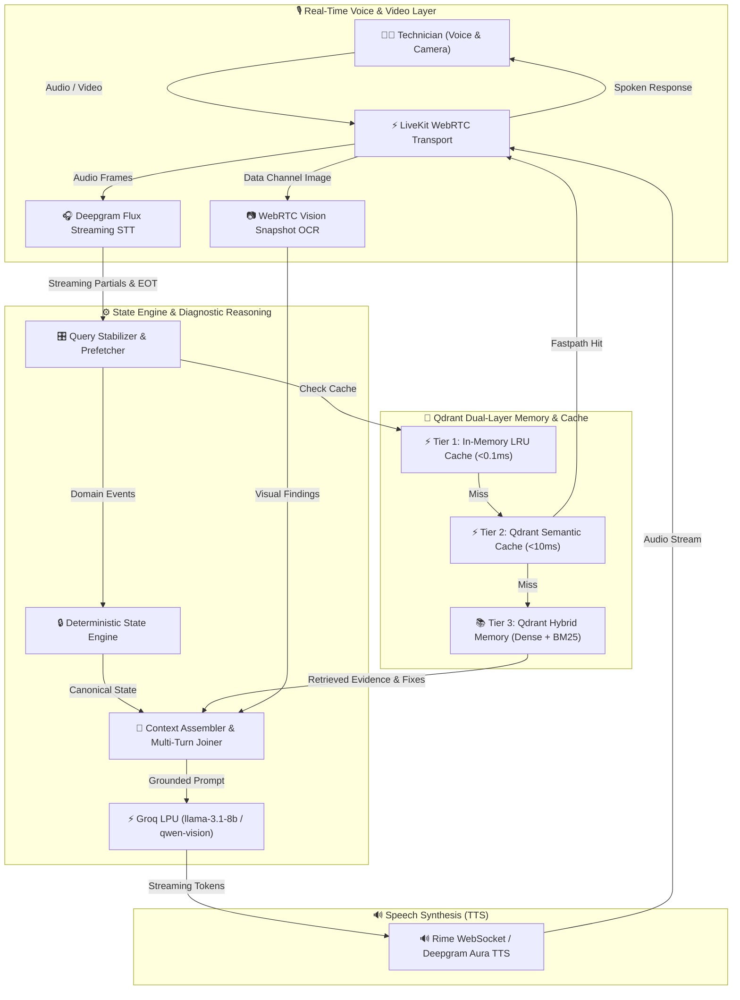

<div align="center">
  <h1>🛠️ FieldMate</h1>
  <p><strong>An ultra-low-latency, real-time voice diagnostic partner for field technicians.</strong></p>

  <!-- Badges -->
  <p>
    <a href="https://github.com/esotericdunce/fieldmate/blob/main/LICENSE"></a>
    
    
    
    
  </p>
</div>

<br />

FieldMate is an open-source, voice-first diagnostic assistant engineered for hardware, software, and network troubleshooting. It acts as an active diagnostic partner for field technicians, lowering cognitive load and drastically speeding up repair times through real-time voice interaction.

---

## 📑 Table of Contents
- [Project Description](#-project-description)
- [System Architecture](#️-system-architecture)
- [Reproducibility & Setup](#-reproducibility--setup)
- [Performance Metrics](#-performance-metrics)
- [Credits & Partners](#-credits--partners)

---

## 📖 Project Description

### 🎯 The Problem
Field technicians face a massive cognitive load when troubleshooting complex hardware or network issues. They must operate testing equipment, manipulate devices physically, navigate manuals, and log findings—all simultaneously. Standard visual or text-based interfaces become severe bottlenecks when a technician's hands and eyes are completely occupied. Inefficient diagnostics lead to extended downtime, costly repeated visits, and the permanent loss of critical domain knowledge when senior technicians retire.

### 💡 Our Solution
We built **FieldMate** to solve this bottleneck. FieldMate is a low-latency, hands-free, voice-first diagnostic partner that actively reasons alongside the technician in real-time. 

### 🔬 Scientific & Development Contribution
Unlike generic conversational RAG (Retrieval-Augmented Generation) chatbots, FieldMate **owns canonical diagnostic state**. We contribute a novel **deterministic state engine** paired with a continuous multi-tier semantic caching system and long-term episodic vector memory. 

This architecture ensures that the underlying LLM reasons over verified, structured diagnostic state rather than unstructured text dumps. This drastically reduces hallucinations and latency, providing verifiable provenance for every recommendation.

---

## 🏗️ System Architecture

FieldMate operates on a state-of-the-art multi-tier pipeline:



---

## 🚀 Reproducibility & Setup

We have designed FieldMate to be easily reproducible. Follow the steps below to spin up your own instance.

### Prerequisites
- **Python 3.12+** and the [`uv`](https://github.com/astral-sh/uv) package manager.
- **Node.js 18+** & `npm` for the frontend.
- API credentials for **LiveKit Cloud**, **Deepgram**, **Groq**, **Rime**, and **Qdrant Cloud**.

### 1. Installation

Clone the repository and install the dependencies:

```bash
# Clone the repo
git clone https://github.com/esotericdunce/fieldmate.git
cd fieldmate

# Install Python dependencies using uv
uv sync

# Build Frontend HUD
cd frontend
npm install && npm run build
cd ..
```

### 2. Configuration

Create your environment configuration file:

```bash
cp .env.example .env
```

Populate `.env` with your API keys:

```env
LIVEKIT_URL=wss://your-livekit-project.livekit.cloud
LIVEKIT_API_KEY=your_livekit_api_key
LIVEKIT_API_SECRET=your_livekit_api_secret

DEEPGRAM_API_KEY=your_deepgram_api_key
GROQ_API_KEY=your_groq_api_key
RIME_API_KEY=your_rime_api_key

QDRANT_URL=https://your-qdrant-cluster.cloud.qdrant.io
QDRANT_API_KEY=your_qdrant_api_key

FIELDMATE_USER_ID=tech_john_doe
```

### 3. Running the Server

Start the unified server (spawns both the FastAPI web server and the LiveKit voice worker):

```bash
uv run python main.py
```
Open `http://localhost:8000` in your browser and click **Start Session** to begin.

### 4. Running the Tests
To verify the deterministic state engine and semantic cache benchmarks, run the automated test suite:
```bash
PYTHONPATH=src uv run pytest
```

---

## 📊 Performance Metrics

FieldMate is engineered for ultra-low-latency real-time voice interaction. We actively monitor the following critical metrics:

| Metric | Target | Why it was chosen |
| :--- | :--- | :--- |
| **End-to-End Voice Latency** | `< 800ms` | In voice interactions, latency over 1s breaks conversational flow. Sub-800ms ensures the technician feels they are speaking with a responsive human partner. |
| **Tier 1 LRU Cache Hit** | `< 0.1ms` | Captures exact-match repeat queries instantly without network overhead, saving LLM and Qdrant round-trips. |
| **Tier 2 Semantic Cache (Qdrant)** | `< 15ms` | Validates that paraphrased identical intents are caught before invoking the LLM, reducing generation time by up to 90% for common diagnostic loops. |
| **State Atomicity Rollbacks** | `100% Success` | Proves that invalid or hallucinated LLM transitions are safely discarded without corrupting the canonical state. |

---

## 🤝 Credits & Partners

A massive thank you to our incredible partners whose cutting-edge technology made FieldMate possible. We are proud to build on top of their platforms:

- 🌟 **Pathway**: For pioneering data processing and real-time streams.
- 🌟 **Rime**: For the ultra-fast, expressive, and human-like neural TTS WebSocket streaming.
- 🌟 **Weya**: For robust platform support and infrastructure.
- 🌟 **Qdrant**: For powering both our sub-15ms semantic caching and our long-term hybrid dense/sparse diagnostic memory layer.

<br/>
<div align="center">
  <sub>Built with ❤️ for field technicians everywhere.</sub>
</div>
