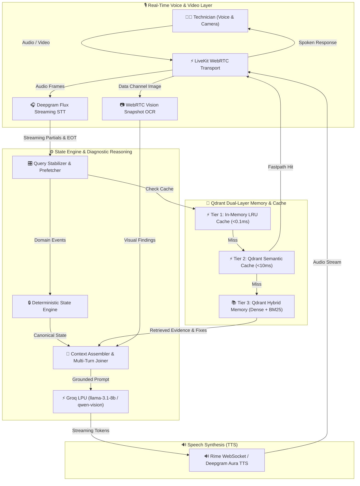

# 🛠️ FieldMate — Real-Time Voice Diagnostic Partner


## 1️⃣ Project Description

**Why we built FieldMate:**
Field technicians troubleshooting complex hardware, software, and networking issues face a massive cognitive load. They must operate testing equipment, physically manipulate devices, navigate manuals, and log findings—all simultaneously. Standard visual or text-based interfaces are a severe bottleneck when a technician's hands and eyes are occupied. We built FieldMate to provide a low-latency, hands-free, voice-first diagnostic partner that can actively reason alongside the technician.

**Why the problem matters:**
Inefficient diagnostics lead to extended equipment downtime, costly repeated technician visits, and massive operational losses for IT departments and OEMs. Furthermore, critical domain knowledge is often lost when experienced technicians retire. Capturing, structuring, and retrieving this diagnostic memory in real-time is essential for scaling field service teams.

**Scientific/Development Contribution:**
Unlike generic conversational RAG (Retrieval-Augmented Generation) chatbots, FieldMate **owns canonical diagnostic state**. We contribute a deterministic state engine paired with a continuous multi-tier semantic caching system and long-term episodic vector memory. This architecture ensures that the LLM reasons over verified, structured diagnostic state rather than unstructured text dumps, drastically reducing hallucinations and latency while providing verifiable provenance for every recommendation.

## 🏗️ System Architecture (Optional Documentation)



## 3️⃣ Reproducibility

### Prerequisites
- **Python 3.12+** & [`uv`](https://github.com/astral-sh/uv) package manager
- **Node.js 18+** & `npm`
- API credentials for LiveKit Cloud, Deepgram, Groq, Rime, and Qdrant Cloud.

### Installation & Configuration

1. **Clone the repository:**
   ```bash
   git clone https://github.com/esotericdunce/fieldmate.git
   cd fieldmate
   ```

2. **Configure Environment:**
   ```bash
   cp .env.example .env
   ```
   Edit `.env` and fill in your credentials:
   ```env
   LIVEKIT_URL=wss://your-livekit-project.livekit.cloud
   LIVEKIT_API_KEY=your_livekit_api_key
   LIVEKIT_API_SECRET=your_livekit_api_secret
   DEEPGRAM_API_KEY=your_deepgram_api_key
   GROQ_API_KEY=your_groq_api_key
   RIME_API_KEY=your_rime_api_key
   QDRANT_URL=https://your-qdrant-cluster.cloud.qdrant.io
   QDRANT_API_KEY=your_qdrant_api_key
   FIELDMATE_USER_ID=tech_john_doe
   ```

3. **Install Dependencies & Build Frontend:**
   ```bash
   uv sync
   cd frontend
   npm install && npm run build
   cd ..
   ```

4. **Launch the Application:**
   ```bash
   uv run python main.py
   ```
   Open `http://localhost:8000` and click **Start Session**.

### Verifying Results
You can replicate our deterministic state engine and semantic cache benchmarks by running our extensive automated test suite:
```bash
PYTHONPATH=src uv run pytest
```

## 4️⃣ Performance Metrics

FieldMate is engineered for ultra-low-latency real-time voice interaction. We actively monitor the following metrics:

1. **Voice-to-Voice Latency (End-to-End): `< 800ms`**
   - *Why chosen:* In voice interactions, any latency over 1 second feels unnatural and disrupts the conversational flow. Sub-800ms ensures the technician feels they are speaking with a responsive partner.
2. **Tier 1 Cache Hit Latency (In-Memory LRU): `< 0.1ms`**
   - *Why chosen:* Captures exact-match repeat queries instantly without network overhead, saving LLM and Qdrant round-trips.
3. **Tier 2 Semantic Cache Latency (Qdrant Cloud): `< 15ms`**
   - *Why chosen:* Validates that paraphrased identical intents are caught before invoking the LLM, reducing average generation time by up to 90% for common diagnostic loops.
4. **Diagnostic State Atomicity Rollbacks: `100% Success Rate`**
   - *Why chosen:* Measured via our adversarial test suite. It proves that invalid or hallucinated transitions are safely discarded without corrupting the canonical state.

## 5️⃣ Credits

A massive thank you to our incredible partners whose cutting-edge technology made FieldMate possible:

- 🤝 **Pathway**: For pioneering data processing and real-time streams.
- 🤝 **Rime**: For the ultra-fast, expressive, and human-like neural TTS WebSocket streaming.
- 🤝 **Weya**: For robust platform support and infrastructure.
- 🤝 **Qdrant**: For powering both our sub-15ms semantic caching and our long-term hybrid dense/sparse diagnostic memory layer.
